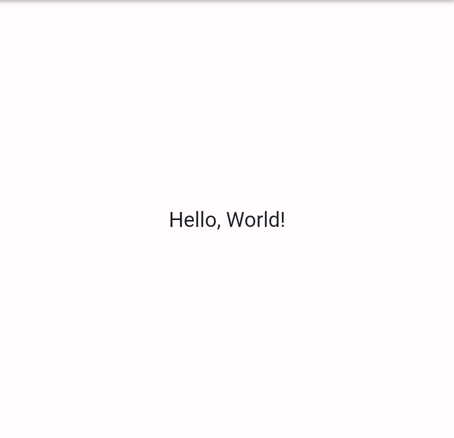

# Workshop: Formularios en Flutter
> El presente Workshop fue creado por [Bettina Carrizo](https://www.linkedin.com/in/bettina-carrizo/), con 💙 desde Uruguay.

---

## Introducción

Bienvenido! 👋

En este Workshop de Flutter te enseñaré a crear Forms y veremos varios conceptos 
necesarios para poder trabajar con ellos y, correctamente permitir al usuario de nuestra
aplicación lograr su objetivo. Manos a la obra 💪👨‍💻

## ¿Qué vamos a construir?

Algo que me gusta hacer siempre antes de abordar un tema es visualizar el resultado final,
qué tan lejos podemos llegar con este Workshop.

En la siguiente imagen se puede visualizar un flujo de registro.


## Para los entusiastas
Al final del Workshop dejaré pequeños desafíos para practicar 🎖️

---

## Antes de comenzar
El código que se encuentra a nuestra derecha es una aplicación básica de Flutter,
la misma que podemos generar utilizando [DartPad](https://dartpad.dev). Esta aplicación la iremos modificando
a medida que vayamos adquiriendo los conceptos hasta llegar a nuestra versión final.

> Aprovechemos este paso del Workshop para hacer una breve limpieza del código. 🧹

### Paso 1
Como nuestra aplicación objetivo tiene fondo (`background`) de color claro, cambiemos
la configuración de la propiedad `theme` dentro de `MaterialApp` para utilizar `light mode`,
de la siguiente manera:

```dart
// ...
theme: ThemeData.light(),
// ...
```

### Paso 2
Eliminemos ahora la constante `darkBlue` que se encuentra en la `línea 3`, ya que no 
la estamos utilizando más.

Ahora deberías ver la misma app que antes pero con fondo blanco 😁

