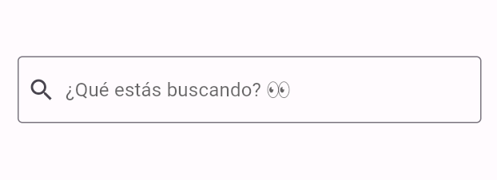

Ahora sí, a lo que nos compete!

# Campos de texto *(text fields)*
Los campos de texto permiten a los usuarios ingresar información en una aplicación, ya sea para 
enviar un mensaje de texto, para rellenar un formulario de registro, realizar búsquedas, 
entre otras.

En Flutter tenemos 2 widgets para crear inputs de texto: 
[TextField](https://api.flutter.dev/flutter/material/TextField-class.html) y 
[TextFormField](https://api.flutter.dev/flutter/material/TextFormField-class.html).

## TextField
Es el widget de tipo `FormField` más utilizado para crear inputs cuando los casos de uso
son simples.

Permite editar una gran variedad de parámetros, aunque la mayoría se utilizan en casos
específicos.

A continuación se visualiza un ejemplo de un `TextField` con decoración básica.

```dart
const TextField(
  decoration: InputDecoration(
    prefixIcon: Icon(Icons.search),
    border: OutlineInputBorder(),
    hintText: '¿Qué estás buscando? 👀',
  ),
);
```

## TextFormField
Es un widget de tipo `FormField` que internamente contiene un `TextField` y permite utilizarlo en 
conjunto con otros widgets del mismo tipo para realizar validaciones de manera super sencilla. 

A continuación podemos visualizar el mismo ejemplo usando `TextFormField`.

````dart
TextFormField(
  decoration: const InputDecoration(
    prefixIcon: Icon(Icons.search),
    border: OutlineInputBorder(),
    hintText: '¿Qué estás buscando? 👀',
  ),
);
````

**En ambos casos el código se visualiza de la siguiente manera:**


Como verás, ambos se pueden visualizar de la misma manera, y es la idea que se puedan estilizar de
igual forma ya que sus objetivos son los mismos.

La realidad es que no hay muchos parámetros que difieran entre ellos. Lo más importante es que el `TextFormField` 
permite indicar funciones de validación de los datos que el usuario escribe. Además,
si el `TextFormField` se utiliza dentro de un [Form](https://api.flutter.dev/flutter/widgets/Form-class.html), podremos realizar las mismas validaciones en conjunto
con los demás `FormFields` que agreguemos dentro del mismo. 

>En pocas palabras, en casos donde precisemos hacer un formulario de tipo **registro o checkout de pasarela
de pagos** (por poner dos ejemplos), nos convendrá utilizar un `Form` con `FormFields` adentro (como el `TextFormField`), 
para fácilmente validar todos los campos de ese formulario en conjunto.
Si en cambio queremos agregar en nuestra app una **cajita de búsqueda o un input para enviar un mensaje**,
con un simple `TextField` será suficiente.

## Repasemos el código

En el código de la derecha, verás que hice un poco más de limpieza con respecto al anterior.
 - Eliminé la clase de `MyWidget`
 - Quité la instancia de `MyWidget` que se encontraba dentro del `Scaffold`
 - Hice actualizaciones dentro del `Scaffold` para mostrar una `Columna` con 2 inputs que se 
encuentre separada por un poco de espaciado (padding).

Si ejecutas el código verás 2 inputs iguales a los de la captura anterior, uno arriba del otro
(ya que se encuentran en un `Column`)

> Este código es de ejemplo pero para que puedan visualizarlo y jugar con él. En la siguiente sección
comenzaremos a crear nuestro `Form` 🙌