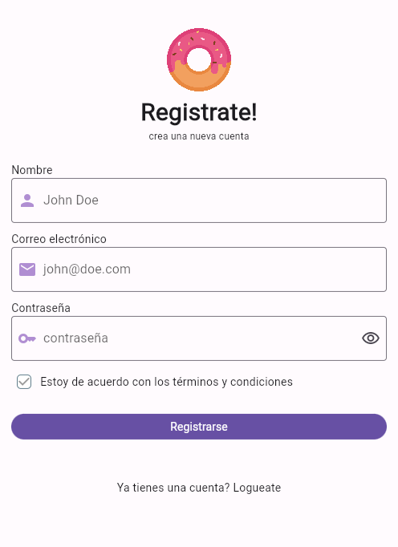
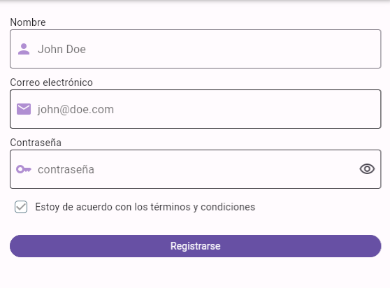

# A crear nuestra UI!
La siguiente imagen muestra el objetivo de este apartado. Vamos a crear nuestra UI con lo que
hemos ido aprendiendo en el curso y le agregaremos los nuevos inputs para luego poder validar
y tomar acciones cuando el usuario interactúa con él.



# Primero el formulario
Dejemos el encabezado y pie del diseño para más adelante, vamos a enfocarnos en lo que nos interesa
ahora 😁

Comencemos por crear nuestros inputs, lo ideal es que todos tengan el mismo diseño (más adelante verán
cómo hacer esto utilizando el `Theme` de la aplicación). Y debido a que estamos creando un formulario de
registro, utilizaremos `TextFormField` para los campos.

Aquí debajo se encuentra el widget de `TextFormField` configurado con los estilos y textos para el
campo de "Nombre". Puedes variar los estilos y jugar con ellos en base a lo que te guste utilizando 
[los ejemplos de la documentación oficial](https://api.flutter.dev/flutter/material/InputDecoration-class.html). 

````dart
TextFormField(
  decoration: const InputDecoration(
    // Configuración del ícono de prefijo
    prefixIcon: Icon(Icons.person),
    prefixIconColor: Color(0xFFB08ED2),
    border: OutlineInputBorder(),
    // Texto que sirve de ayuda para completar la inform
    hintText: 'John Doe',
    // Nos permite indicar un color de borde cuando el input está en foco
    focusedBorder: OutlineInputBorder(
      borderSide: BorderSide(
        color: Color(0xFFB08ED2),
        width: 2,
      ),
    ),
  ),
);
````

El input de **Correo electrónico** varía muy poco, y el de **Contraseña** tiene algunas cositas más 😛.

Inicialmente, para el input de contraseña vamos a hacerlo similar a los otros (sin el ojito a la derecha),
y lo único extra que debemos configurar para que no podamos visualizar el texto que se ingresa en ese
campo es la propiedad `obscureText` del `TextFormField`. Esa propiedad recibe un booleano (`true` o `false`) que indica
si se quiere ocultar el contenido del texto o no, respectivamente.

# Desafío
1. Completa los TODOs de la derecha utilizando el ejemplo del `TextFormField` visto anteriormente
y realizando las modificaciones correspondientes en cada caso.

> Nota: `Icons.email` e `Icons.key` te servirán para los `prefixIcon` de los inputs de correo electrónico y contraseña
> respectivamente.

# Toques finales

## Agregando el "ojito" al input de contraseña
Para poder ver el ícono de ojo (y permitir al usuario que visualice u oculte la contraseña), vamos a 
agregar un widget de `IconButton` (que nos permita luego hacer click sobre él), y utilizando el widget de `Stack`
lo posicionaremos donde nos guste, de la siguiente manera.

````dart
Stack(
  alignment: Alignment.center, // Esto nos permite centrar por defecto la posición de cada widget
  children: [
    // Este es el mismo TextFormField que creamos anteriormente, agregado dentro del Stack
    const TextFormField(
      obscureText: true,
      decoration: InputDecoration(
        prefixIcon: Icon(Icons.key),
        prefixIconColor: Color(0xFFB08ED2),
        border: OutlineInputBorder(),
        hintText: 'contraseña',
      ),
    ),
    // Align nos permite facilmente posicionar un elemento en un Stack
    Align(
      alignment: Alignment.centerRight,
      child: IconButton(
        onPressed: () {}, // Luego agregaremos lógica aquí
        icon: const Icon(Icons.visibility_outlined),
      ),
    )
  ],
)
````

Si te animas puedes ya agregar esta mejora al input de contraseña para que sigamos trabajando con él en los pasos
siguientes 😁

## Agregando el Checkbox
Para solicitar al usuario que acepte los Términos y Condiciones agregaremos un `Checkbox` debajo del form. 
Para ello utilizaremos simplemente 3 widgets: `Checkbox`, `Text` y `Row` para mostrarlos de manera horizontal.
Ah! Y un `SizedBox` para agregar un poco de espacio 😁

````dart
Row(
  children: [
    Checkbox(
      checkColor: Colors.grey,
      splashRadius: 0,
      fillColor:
          MaterialStateProperty.resolveWith((states) => Colors.white),
      shape: RoundedRectangleBorder(borderRadius: BorderRadius.circular(5)),
      side: MaterialStateBorderSide.resolveWith(
          (states) => const BorderSide(color: Colors.blueGrey)),
      value: true, // Este valor dependerá de un estado local
      onChanged: (bool? value) {}, // onChanged es un callback que nos permite reaccionar cuando el valor se actualiza
    ),
    const SizedBox(width: 4),
    const Text('Estoy de acuerdo con los términos y condiciones'),
  ],
)
````

# Resultado del form hasta el momento
Luego de completados los TODOs de inputs deberíamos visualizar algo como esto:



> 💡 Nuestro widget principal está quedando muy grande y va a ser complicado de trabajar a futuro,
> podemos ir creando mini componentes o widgets individuales para que el widget principal
> sea más sencillo de visualizar.
