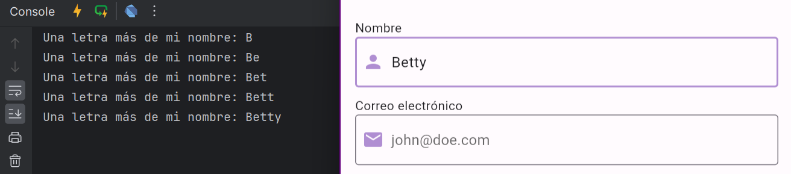

# ¿Cómo reaccionar a cambios del input?
Existen 2 maneras de emitir una acción cuando el contenido de un input cambia, la
primera (aunque un poco más compleja) es utilizando el controller del input, y escuchando 
sus cambios. Puedes aprender más sobre eso [aquí](https://docs.flutter.dev/cookbook/forms/text-field-changes#2-use-a-texteditingcontroller).
La otra manera es utilizando el callback `onChanged` disponible en los `TextField` y `TextFormField`.

> 💡 `onChanged` es mucho más intuitivo de utilizar y funciona exactamente igual que el controller.

# Veamos cómo funciona `onChanged`
Volvamos con el ejemplo del `NameInput`,

````dart
class NameInput extends StatelessWidget {
  const NameInput({
    required this.controller,
    super.key,
  });

  final TextEditingController controller;

  @override
  Widget build(BuildContext context) {
    return TextFormField(
      controller: controller,
      decoration: const InputDecoration(
        prefixIcon: Icon(Icons.person),
        prefixIconColor: Color(0xFFB08ED2),
        border: OutlineInputBorder(),
        hintText: 'John Doe',
        focusedBorder: OutlineInputBorder(
          borderSide: BorderSide(
            color: Color(0xFFB08ED2),
            width: 2,
          ),
        ),
      ),
      // Utilizando el onChanged para que cada vez que se llame haga print en consola
      // mostrando el nuevo valor.
      onChanged: (newValue) {
        print('Una letra más de mi nombre: $newValue');
      },
      validator: (value) {
        if (value == null || value.isEmpty) {
          return 'Por favor, ingrese un nombre';
        }
        return null;
      },
    );
  }
}
````

Si refrescan la app y comienzan a escribir, verán lo siguiente en la consola:



> Pueden mejorar sus inputs para recibir una función que la misma reciba un String con el
> último valor del input, y se pueda enviar ese cambio hacia afuera del input en cuestión.

A modo de ejemplo:

````dart
class NameInput extends StatelessWidget {
  const NameInput({
    required this.controller,
    required this.onNameChanged,
    super.key,
  });

  final TextEditingController controller;
  final void Function(String) onNameChanged;

  @override
  Widget build(BuildContext context) {
    return TextFormField(
      controller: controller,
      decoration: const InputDecoration(
        prefixIcon: Icon(Icons.person),
        prefixIconColor: Color(0xFFB08ED2),
        border: OutlineInputBorder(),
        hintText: 'John Doe',
        focusedBorder: OutlineInputBorder(
          borderSide: BorderSide(
            color: Color(0xFFB08ED2),
            width: 2,
          ),
        ),
      ),
      onChanged: onNameChanged,
      validator: (value) {
        if (value == null || value.isEmpty) {
          return 'Por favor, ingrese un nombre';
        }
        return null;
      },
    );
  }
}
````

Y cuando llamas al NameInput:

````dart
  NameInput(
    controller: _nameInputController,
    onNameChanged: (newValue) {
      ScaffoldMessenger.of(context)
       // Borramos el SnackBar anterior para que se muestre el nuevo siempre
        ..clearSnackBars()
        ..showSnackBar(
          SnackBar(
            backgroundColor: Colors.blue,
            content: Text('Estás escribiendo: $newValue...'),
          ),
        );
    },
  ),
````

# onEditingCompleted
Callback que se invica cuando el usuario oprimne el botón de Done en el teclado. O
por defecto también cuando se oprimen teclas de next o previous.

# onSubmitted
Callback que se invoca cuando el usuario indica que terminó de rellenar el input de texto.
Por defecto se llama luego del `onChanged` cuando el usuario terminó de editar. Si el comportamiento
se sobrescribe, se invocará luego del `onEditingComplete`.

## Desafío
Cambia el llamado de `onChanged` que fue agregado en `NameInput`, y utiliza `onSubmitted` en vez.